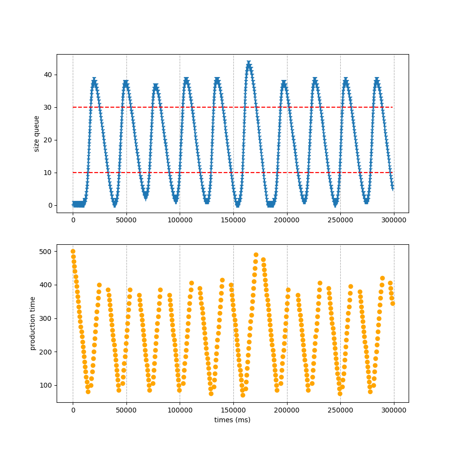

<p align="center">
	
</p>

# ProducerConsumerRealTime 🕒🔄

Welcome to **ProducerConsumerRealTime**! This repository contains a real-time implementation of the Producer-Consumer pattern in pure C. The Producer-Consumer problem is a classic synchronization issue in concurrent programming where producers generate data to be consumed by consumers. This project is part of the final exam for the course **Concurrent and Real-Time Programming** with Professor Gabriele Manduchi.

## 🌟 Introduction 

The Producer-Consumer pattern is essential for managing concurrent processes that share resources. This implementation demonstrates how to handle real-time data production and consumption efficiently using pure C. Additionally, an analyzer adjusts the production rate of the producer based on real-time data.

## 📜 Problem Statement 

Producer-(single) consumer program with dynamic message rate adjustment. The consumer shall consume messages at a given rate, that is, with a given delay simulating the consumed message usage. An actor (task or process) separate from the producer and consumer shall periodically check the message queue length and if the length is below a given threshold, it will increase the production rate. Otherwise (i.e., the message length is above the given threshold), it will decrease the production rate.

## 🚀 Getting Started 

### 🛠️ Prerequisites 

Before you begin, ensure you have the following installed:
- GCC (GNU Compiler Collection)
- Make (build automation tool)
- Python (for plotting)

### 💻 Installation 

1. Clone the repository:
   ```bash
   git clone https://github.com/RickSrick/ProducerConsumerRealTime.git
   ```
2. Navigate to the project directory:
   ```bash
   cd ProducerConsumerRealTime
   ```
3. Build the project using Make:
   ```bash
   make
   ```

## 🔧 Usage 

### 🏃 Executing the Program 

To run the program, use the following command (make sure you are sudouser for priority and scheduling assignment):
```bash
./src/prod_cons_local
```
This will start the producer, consumers and the analyzer. You will see alternating "produce" and "digest" messages, indicating that the Producer and Consumer are working in tandem to handle data. The analyzer will adjust the production rate based on real-time data. If you press **m** you can increment the consuming rate, with **n** you will decrease it.

### 📊 Building the Plot 

To visualize the data flow, you can generate a plot using the existing Python script. Ensure you have Matplotlib installed.

1. Install Matplotlib:
   ```bash
   pip install matplotlib
   ```
2. Run the existing Python script:
   ```bash
   python src/plot.py
   ```
This will generate a plot showing the data produced and consumed over time.

#### Example Plot

Here is an example of what the plot might look like:



---

<p align="center">
University of Padova - Computer Engineering
</p>
